# 棋类对战平台设计文档

**姓名**： 李可涵  
**学号**： 2024214466  
**代码仓库**：[GitHub 链接](https://github.com/yzjlike0718/OOP2024-Chess)
**演示视频**：[清华云盘链接](https://cloud.tsinghua.edu.cn/f/ab1d77c88b63411dbdb0/)

---

## 1. 系统概述

该平台是一个支持多种棋类游戏的对战平台，功能包括：
- 第一阶段：五子棋和围棋对战，支持悔棋、存档、加载等操作。
- 第二阶段：新增黑白棋对战、AI自动落子（支持玩家-AI、AI-AI对战）、录像与回放功能，以及用户账户管理。

---

## 2. 设计目标

1. **模块化**：将规则、UI、逻辑等模块分离，便于维护和扩展。
2. **可扩展性**：采用面向对象设计，新增游戏类型或功能时无需修改已有代码。
3. **高内聚低耦合**：通过设计模式提高代码复用性和灵活性。
4. **用户友好**：提供易用的交互界面及多样化功能。

---

## 3. 设计模式选用

### 第一阶段设计模式
1. **工厂模式**：
   - **应用位置**：`GameFactory` 创建游戏对象。
   - **作用**：解耦客户端与具体游戏逻辑，便于扩展。
2. **策略模式**：
   - **应用位置**：`GameRule` 定义棋类规则，具体实现如 `GomokuRule` 和 `GoRule`。
   - **作用**：灵活支持不同游戏规则。
3. **备忘录模式**：
   - **应用位置**：`Memento` 保存棋盘状态，`Caretaker` 管理状态历史。
   - **作用**：实现悔棋功能。
4. **模板方法模式**：
   - **应用位置**：`Client.play_game()` 提供游戏的主循环框架。
   - **作用**：定义通用流程，子类可扩展具体逻辑。

### 第二阶段新增设计模式
1. **代理模式**：
   - **应用位置**：`ProxyAccountManager` 代理用户管理功能。
   - **作用**：控制访问，保护账户数据。
2. **抽象工厂模式**：
   - **应用位置**：`AIFactory` 用于创建不同棋类的 AI 实例。
   - **作用**：解耦 AI 生成逻辑，便于扩展。

---

## 4. 系统架构

系统主要分为以下模块：
1. **游戏规则模块**：定义棋类规则和游戏胜负判断。
2. **游戏逻辑模块**：管理棋盘状态及游戏进程。
3. **用户界面模块**：负责与用户交互。
4. **AI模块**：实现自动落子功能。
5. **用户管理模块**：提供账户注册、登录、战绩记录功能。
6. **录像（存储）与回放（加载）模块**：支持保存和回放对局历史。

---

## 5. 核心类和方法说明

本文档仅对突出设计思想的重要类与方法进行说明，详细实现逻辑请见代码注释。

### 游戏规则模块

- **抽象类 `GameRule`**：定义通用规则接口。
- **具体实现**：
  - `GomokuRule`：五子棋规则。
  - `GoRule`：围棋规则。
  - `OthelloRule`：黑白棋规则。

### 游戏逻辑模块
- **抽象类 `Game`**：定义通用游戏逻辑。
- **具体实现**：
  - `GomokuGame`：五子棋逻辑。
  - `GoGame`：围棋逻辑。
  - `OthelloGame`：黑白棋逻辑。

### 用户界面模块
- **抽象类 `UITemplate`**：定义用户界面接口。
- **具体实现**：
  - `GomokuUI` 和 `GoUI`：分别对应五子棋和围棋界面。

### AI模块
- **抽象类 `GameAI`**：定义通用 AI 接口。
- **具体实现**：
  - `GomokuAILevel1` 和 `GomokuAILevel2`：不同等级的五子棋 AI。
  - `OthelloAILevel1` 和 `OthelloAILevel2`：不同等级的黑白棋 AI。

### 用户管理模块
- **类 `ProxyAccountManager`**：代理账户管理逻辑。
- **方法**：
  - `register()`：注册用户。
  - `login()`：用户登录。
  - `update_account_info()`：更新战绩。

### 录像与回放模块
- **方法**：
  - `store_state()`：存储当前局面。
  - `load_state()`：加载局面或回放历史。

---

## 6. UML 类图

```mermaid
classDiagram
    class Client {
        -game_name: str
        -game_over: bool
        -turn: int
        -game_factory: GameFactory
        -game: Game
        -caretaker: Caretaker
        -UI_factory: UIFactory
        -UI_platform: UITemplate
        -AI_factory: AIFactory
        -winner: str
        -allow_undo: bool
        -players: tuple[Player, Player]
        +choose_game(game_name: str)
        +init_board(board_size: int)
        +set_game()
        +make_move(row: int, col: int)
        +undo_move(): str
        +new_turn()
        +check_finish()
        +next_turn()
        +play_game(game_name: str, board_size: int)
    }

    class GameFactory {
        <<Abstract>>
        +createGame(): Game
    }

    class GomokuFactory {
        +createGame(): GomokuGame
    }

    class GoFactory {
        +createGame(): GoGame
    }

    class OthelloFactory {
        +createGame(): OthelloGame
    }

    GameFactory <|-- GomokuFactory
    GameFactory <|-- GoFactory
    GameFactory <|-- OthelloFactory

    class Game {
        <<Abstract>>
        -rule: GameRule
        -chessboard: Chessboard
        -turn_taken: bool
        +create_memento(): Memento
        +restore_memento(memento: Memento)
        +make_move(row: int, col: int, curr_turn: str)
        +allow_winner_check(): bool
        +next_turn_allowed(): tuple[bool, str]
        +capture()
    }

    class GomokuGame {
        +capture()
        +allow_winner_check(): bool
        +next_turn_allowed(): tuple[bool, str]
    }

    class GoGame {
        +capture()
        +allow_winner_check(): bool
        +next_turn_allowed(): tuple[bool, str]
    }

    class OthelloGame {
        +capture()
        +allow_winner_check(): bool
        +next_turn_allowed(): tuple[bool, str]
    }

    Game <|-- GomokuGame
    Game <|-- GoGame
    Game <|-- OthelloGame

    class GameRule {
        <<Abstract>>
        +is_valid_move(row: int, col: int, board: Chessboard, curr_turn: str, turn_taken: bool): bool
        +is_within_board(row: int, col: int, board: Chessboard): bool
        +check_win(board: Chessboard): str
        +check_draw(board: Chessboard): bool
    }

    class GomokuRule {
        +is_valid_move(row: int, col: int, board: Chessboard, curr_turn: str, turn_taken: bool): bool
        +check_win(board: Chessboard): str
        +check_draw(board: Chessboard): bool
    }

    class GoRule {
        +is_valid_move(row: int, col: int, board: Chessboard, curr_turn: str, turn_taken: bool): bool
        +check_win(board: Chessboard): str
        +check_draw(board: Chessboard): bool
    }

    class OthelloRule {
        -get_flippable_chess(row: int, col: int, board: Chessboard, curr_turn: str)
        -flip_chess(positions: tuple[int, int], board: Chessboard, curr_turn: str)
        +is_valid_move(row: int, col: int, board: Chessboard, curr_turn: str, turn_taken: bool): bool
        +check_win(board: Chessboard): str
        +check_draw(board: Chessboard): bool
    }

    GameRule <|-- GomokuRule
    GameRule <|-- GoRule
    GameRule <|-- OthelloRule

    class Chessboard {
        -size: int
        -board: list[str]
        +set_chess(row: int, col: int, chess_type: str)
        +get_chess(row: int, col: int): str
        +set_board(board: list[str])
    }

    class Memento {
        -state: Chessboard
        +get_chessboard(): Chessboard
    }

    class Caretaker {
        -memento_list: list[Memento]
        +save_memento(memento: Memento)
        +undo(): Memento
    }

    class UITemplate {
        +detect_event()
        +draw_button()
        +choose_game(): str
        +choose_board_size(): int
        +display_chessboard(chessboard: Chessboard, turn: str)
    }

    class GomokuUI {
        +display_right_sidebar(turn: str)
    }

    class GoUI {
        +display_right_sidebar(turn: str)
    }

    class OthelloUI {
        +display_right_sidebar(turn: str)
    }

    UITemplate <|-- GomokuUI
    UITemplate <|-- GoUI
    UITemplate <|-- OthelloUI

    class AIFactory {
        <<Abstract>>
        +createAI(level: int, color: str): GameAI
    }

    class GomokuAIFactory {
        +createAI(level: int, color: str): GomokuAI
    }

    class OthelloAIFactory {
        +createAI(level: int, color: str): OthelloAI
    }

    AIFactory <|-- GomokuAIFactory
    AIFactory <|-- OthelloAIFactory

    class GameAI {
        <<Abstract>>
        +calculate_move(chessboard: Chessboard): tuple[int, int]
    }

    class GomokuAI {
        <<Abstract>>
        +calculate_move(chessboard: Chessboard): tuple[int, int]
    }

    class OthelloAI {
        <<Abstract>>
        +calculate_move(chessboard: Chessboard): tuple[int, int]
    }

    class GomokuAILevel1 {
        +calculate_move(chessboard: Chessboard): tuple[int, int]
    }

    class GomokuAILevel2 {
        +calculate_move(chessboard: Chessboard): tuple[int, int]
    }

    class OthelloAILevel1 {
        +calculate_move(chessboard: Chessboard): tuple[int, int]
    }

    class OthelloAILevel2 {
        +calculate_move(chessboard: Chessboard): tuple[int, int]
    }

    GomokuAIFactory --> GomokuAILevel1
    GomokuAIFactory --> GomokuAILevel2
    OthelloAIFactory --> OthelloAILevel1
    OthelloAIFactory --> OthelloAILevel2

    GameAI <|-- GomokuAI
    GameAI <|-- OthelloAI
    GomokuAI <|-- GomokuAILevel1
    GomokuAI <|-- GomokuAILevel2
    OthelloAI <|-- OthelloAILevel1
    OthelloAI <|-- OthelloAILevel2

    class AccountManager {
        <<Abstract>>
        +register(username: str, password: str): tuple[bool, str]
        +login(username: str, password: str): tuple[bool, str]
    }

    class RealAccountManager {
        -filepath: str
        -accounts: dict
        +register(username: str, password: str): tuple[bool, str]
        +login(username: str, password: str): tuple[bool, str]
        +update_account_info(username: str, games: int, wins: int): void
    }

    class ProxyAccountManager {
        -real_account_manager: RealAccountManager
        -logged_in_users: set
        +register(username: str, password: str): tuple[bool, str]
        +login(username: str, password: str): tuple[bool, str]
        +is_logged_in(username: str): bool
        +update_account_info(player: Player): void
    }

    AccountManager <|-- RealAccountManager
    AccountManager <|-- ProxyAccountManager
    ProxyAccountManager --> RealAccountManager

    class Player {
        -is_guest: bool
        -is_AI: bool
        -name: str
        -color: str
        -games: int
        -wins: int
    }

    Client --> GameFactory
    Client --> Game
    Client --> Caretaker
    Client --> UITemplate
    Client --> AIFactory
    Client --> Player
    Client --> ProxyAccountManager
    Game --> Chessboard
    Game --> GameRule
    Game --> Memento
    Caretaker --> Memento

```

---

## 7. 测试

运行 `python client.py`，通过以下用例测试：
1. UI 及交互。
2. 账户注册、登录及战绩更新。
3. 五子棋、围棋、黑白棋基本对战及规则校验。
4. 五子棋、黑白棋玩家-AI对战。
5. 五子棋、黑白棋AI-AI对战。
6. 悔棋、认输、重开、获取提示等。
7. 局面存储与加载。
8. 录像与回放功能。
