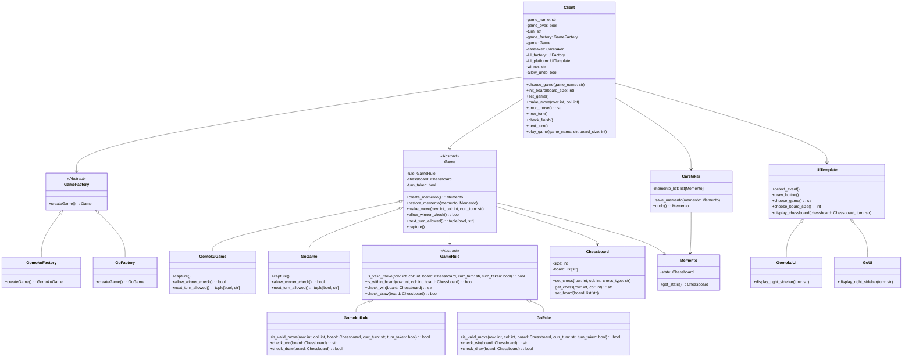

# OOP大作业棋类对战平台设计文档

**姓名：**李可涵	

**学号：**2024214466

**代码仓库**：https://github.com/yzjlike0718/OOP2024-Chess

**演示视频**：

## 1. 设计思路

### 系统概述
该平台支持两种棋类游戏：**五子棋 (Gomoku)** 和 **围棋 (Go)**。用户可通过界面选择游戏类型，进行对局并使用操作如悔棋、存档、加载等。平台通过抽象类、工厂模式及策略模式来实现扩展性和复用性。

### 设计目标
1. **模块化**：各模块（如规则、UI、逻辑）分离，便于维护和扩展。
2. **可扩展性**：通过工厂模式和策略模式，可方便新增其他棋类游戏。
3. **面向对象**：体现单一职责原则 (SRP)、开闭原则 (OCP)、依赖倒置原则 (DIP) 等。

---

## 2. 设计模式选用

### 1. 工厂模式
- **应用位置**：
  - `GameFactory` 创建游戏对象（五子棋或围棋）。
  - `UIFactory` 创建对应游戏的用户界面。
- **作用**：解耦客户端与具体产品，便于新增游戏类型。

### 2. 策略模式
- **应用位置**：
  - `GameRule` 定义棋类规则，`GomokuRule` 和 `GoRule` 提供具体实现。
- **作用**：为不同棋类提供灵活的规则实现。

### 3. 备忘录模式
- **应用位置**：
  - `Memento` 保存棋盘状态，`Caretaker` 管理状态历史。
- **作用**：实现悔棋功能，遵循封装原则。

### 4. 模板方法模式
- **应用位置**：
  - `Client.play_game()` 提供游戏的主循环框架。
- **作用**：定义通用流程，子类可按需扩展具体逻辑。

---

## 3. 关键类和函数说明

### 核心模块概述
1. **棋盘模块**：`Chessboard` 类，管理棋盘状态。
2. **游戏规则模块**：`GameRule` 和其子类，定义合法性、胜负等逻辑。
3. **游戏逻辑模块**：`Game` 类，处理游戏状态及操作。
4. **用户界面模块**：`UITemplate` 和其子类，管理用户交互。
5. **状态管理模块**：`Memento` 和 `Caretaker`，实现悔棋功能。

### 类和方法说明
#### 1. 棋盘类：`Chessboard`
- **方法**：
  - `set_chess(row, col, type)`：在指定位置放置棋子。
  - `get_chess(row, col)`：获取指定位置棋子的类型。

#### 2. 游戏规则类：`GameRule` (抽象类)
- **子类**：
  - `GomokuRule`：五子棋规则。
  - `GoRule`：围棋规则。
- **方法**：
  - `is_valid_move(row, col)`：判断落子是否合法。
  - `check_win(board)`：判断胜负。

#### 3. 游戏逻辑类：`Game`
- **子类**：
  - `GomokuGame`：五子棋逻辑。
  - `GoGame`：围棋逻辑。
- **方法**：
  - `make_move(row, col, turn)`：执行落子。
  - `create_memento()` 和 `restore_memento(memento)`：实现悔棋功能。

#### 4. 用户界面类：`UITemplate`
- **子类**：
  - `GomokuUI` 和 `GoUI`。
- **方法**：
  - `detect_event()`：捕获用户事件。
  - `display_chessboard(chessboard, turn)`：渲染棋盘。

---

## 4. 面向对象设计原则体现

1. **单一职责原则 (SRP)**：
   - `Chessboard` 仅负责棋盘管理。
   - `GameRule` 仅负责规则逻辑。
   - `UITemplate` 仅负责界面呈现。

2. **开闭原则 (OCP)**：
   - 新增游戏只需扩展 `GameFactory` 和 `GameRule` 的子类。

3. **依赖倒置原则 (DIP)**：
   - `Client` 依赖抽象类（如 `GameFactory` 和 `GameRule`）。

---

## 5. UML 类图

---

## 6. 测试

运行 `python main.py` 进入游戏。

由于截图较难简便地展示棋盘动态变化过程，文档中仅列出测试场景，测试过程及结果见演示视频。

**基础通用功能**：
- UI 界面显示
- 选择棋类
- 选择棋盘大小
- 交替行棋
- 投子认输
- 重启游戏
- 悔棋一步（合法及不合法情况）
- 存储/加载局面（合法及不合法情况）
- 操作提示

**五子棋**：
- 终局判断

**围棋**：
- 终局判断
- 虚着（跳过当前行棋）
- 提子（合法/不合法/忘记提子）
- 禁着点
